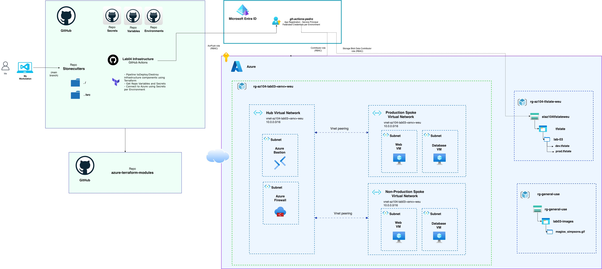

# LAB04: Deploy a Secure Hub and Spoke Network with Azure Firewall

## Objetivo

Diseñar, desplegar y operar una arquitectura mínima pero realista en Azure para una fintech, aplicando seguridad por defecto, trazabilidad, IaC reusable y CI/CD con controles, como en producción

### Conceptos

- Arquitectura Hub & Spoke
- Versionamiento de los modulos
- Importar un template de pipeline
- Bastion with VM (DMZ)
- Peering, UDR, Private Link
- Firewall
- Service Endpoint, Private Endpoint

## Arquitectura

## Deployment steps

1. **Crear estructura del repositorio Base del proyecto.**
   Objetivo: que Terraform y CI/CD funcionen antes de crear recursos.
    - Repo
        - /modules (módulos versionados) -- Cada módulo con tags semver: v1.0.0, v1.1.0
        - /envs/dev y /envs/prod con el “root module”
        - /pipelines/templates (templates YAML reutilizables)
        - /scripts/validate (controles custom)
    - Estándares (see [CODE_STYLE.md](CODE_STYLE.md))
    - Backend
    - Naming
    - **GitHub:** Secrets and/or environment variables (see [CI/CD setup](#cicd-github-actions) below).  
      _(Previously: Variable Groups in Azure DevOps.)_

    _Checks_
    - terraform fmt -check
    - terraform validate
    - terraform plan (sin aplicar aún)  
    
2. **Red Hub & Spokes + peering + UDR (sin PaaS todavía)**
   Objetivo: conectividad + control de rutas.
    - VNets + subnets
    - Peerings
    - Route tables en spokes apuntando al Firewall (placeholder)  

    _Checks_
    - Peering en estado “Connected”
    - Rutas efectivas muestran default route hacia el firewall (una vez exista)  
   
3 **Bastion + acceso admin**
   Objetivo: cero admin público.
    - Bastion en Hub
    - VMs (API y DB) sin Public IP
        
    _Checks_
    - No existe Public IP asociada a NICs
    - Acceso a VM solo vía Bastion  

4. **Firewall + Policy**
   Objetivo: salida controlada + trazabilidad de egreso.
    - Azure Firewall (con subnets requeridas)
    - Firewall Policy con:
        - reglas mínimas (DNS, NTP, ACR/KeyVault/Storage si aplican)

5. **Seguridad en la red (Network Security Groups)**
    NSGs (Network Security Groups): Vital. El Firewall controla quién entra a la VNet (Nivel 4-7), pero el NSG controla el tráfico entre subredes (Micro-segmentación).
    Objetivo: La subred de app solo pueda hablar con la snubnet de DB por el puerto de la base de datos (ej. 5432 o 1433).
    Solo recibir tráfico desde la Hub (Bastion y Firewall)

6. **Resolucion de nombres (DNS Private Zones)**
    Indispensable! En el mundo real nadie usa IPs. Quieres que tu Web App busque a la base de datos como sql-app1.internal.com.
    Objetivo: Que la Web App pueda resolver los nombres de los servicios privados. Igualmente entre VMs.

7. **Logging y monitoreo (Log Analytics & Diagnostic Settings)**
    Objetivo: Tener trazabilidad de lo que pasa en la red.
    Lograr ver en tiempo real por qué el Firewall bloqueó un paquete o quién entró por Bastion.

8. **Secretos (Azure Key Vault)**
    Guardar la contraseña de la DB o mover la SSH Private Key aquí. Es el estándar para manejar secretos.

9. **Application Workload (Web App + DB:)**
   Instalar algo real (un Nginx o una pequeña app en Python/Node) para hacer pruebas de conectividad mas avanzadas y como validación de negocio.

10. **Private Endpoints**
    En lugar de que la base de datos tenga una IP pública, configurar una IP privada dentro de mi VNet.

9. **App Gateway WAF + “API solo por entrada única”**
   Objetivo: endpoint público único (controlado) y backend privado.
   - App Gateway WAF v2 en subnet dedicada
   - Certificado TLS (para lab: self-signed o Key Vault + cert)
   - Backend pool → VM API privada
   - Health probes y rules
   - WAF en modo Prevention (o Detection primero)  

   _Checks_
   - curl https://api.consmefulanito.site/balance responde
   - VM API no es accesible directo desde Internet  
   
6. **Private Endpoints + Private DNS (ACR, KV, Storage)**
   Objetivo: PaaS solo por red privada.
   - Private Endpoint(s) en Hub
   - Private DNS Zones:
     - privatelink.azurecr.io
     - privatelink.vaultcore.azure.net
     - privatelink.blob.core.windows.net
   - VNet links (Hub y spokes)
   - Deshabilitar acceso público en esos servicios  
   
   _Checks_
   - nslookup <acr>.azurecr.io → IP privada
   - Desde VM en spoke: pull de ACR sin salida pública
   - KV/Storage accesibles por private endpoint y bloqueados públicamente

## CI/CD (GitHub Actions)

This repo uses **GitHub Actions** for Terraform plan/apply and destroy. Workflows live in the repo root under `.github/workflows/`:

| Workflow | Purpose |
|----------|---------|
| `lab04-infra-ci.yaml` | Plan + Apply (manual run, choose Dev or Prod) |
| `lab04-infra-destroy.yaml` | Destroy (manual run, choose Dev or Prod) |

### Required setup

1. **GitHub Environments** (optional but recommended): Create environments `Dev` and `Prod` in the repo (Settings → Environments). You can add protection rules and environment-specific secrets.

2. **Secrets** (repository or environment level):
   - `AZURE_CLIENT_ID` – App (client) ID of the service principal or app registration used for OIDC.
   - `AZURE_TENANT_ID` – Azure AD tenant ID.
   - `AZURE_SUBSCRIPTION_ID` – Azure subscription ID.
   - `HOSTINGER_API_TOKEN` – Only if your root module uses the Hostinger provider.

3. **Variables** (repository or environment level, non-sensitive):
   - `TF_BACKEND_RG_NAME` – Resource group of the Terraform state storage account.
   - `TF_BACKEND_STORAGE_ACCOUNT` – Storage account name for state.
   - `TF_BACKEND_CONTAINER` – Container name (e.g. `tfstate`).
   The state file key is derived from the environment choice: `lab-04/dev.tfstate` or `lab-04/prod.tfstate` (folder within the container). The tfvars file used is `dev.tfvars` or `prod.tfvars` accordingly.

4. **Azure OIDC**: Configure an Azure AD app registration with federated credentials for GitHub (repository and branch/ref). Grant the identity access to the subscription and to the state storage account (e.g. Storage Blob Data Contributor). See [GitHub: OpenID Connect in Azure](https://docs.github.com/en/actions/security-for-github-actions/security-hardening-your-deployments/configuring-openid-connect-in-azure).

The pipelines under `pipelines/infra/` are the original **Azure DevOps** YAML definitions (kept for reference). Use the workflows in `.github/workflows/` for this GitHub repo.
